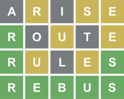

# GuessTheWord / Wordle

Wordle is a word game created and developed by Welsh software engineer Josh Wardle, and owned and 
published by The New York Times Company since 2022. Players have six attempts to guess a 
five-letter word, with feedback given for each guess in the form of colored tiles indicating 
when letters match or occupy the correct position. 

This is a simple implementation in Swift using SwiftUI.  

## Rules
Your challenge is to guess a five-letter word in six attempts. Each time you guess, you're told 
which of your chosen letters are in the target word, and whether they are in the right place. And that's it.

* You have to guess the Wordle in six goes or less
* Every word you enter must be in the word list. There are 1789 german words (at the time of writing) are answers to a specific puzzle
* Words can contain the letters ä, ö, ü never replace with ae, oe, ue!
* A correct letter turns green
* A correct letter in the wrong place turns yellow
* An incorrect letter turns gray
* Letters can be used more than once
* Answers are never plurals

